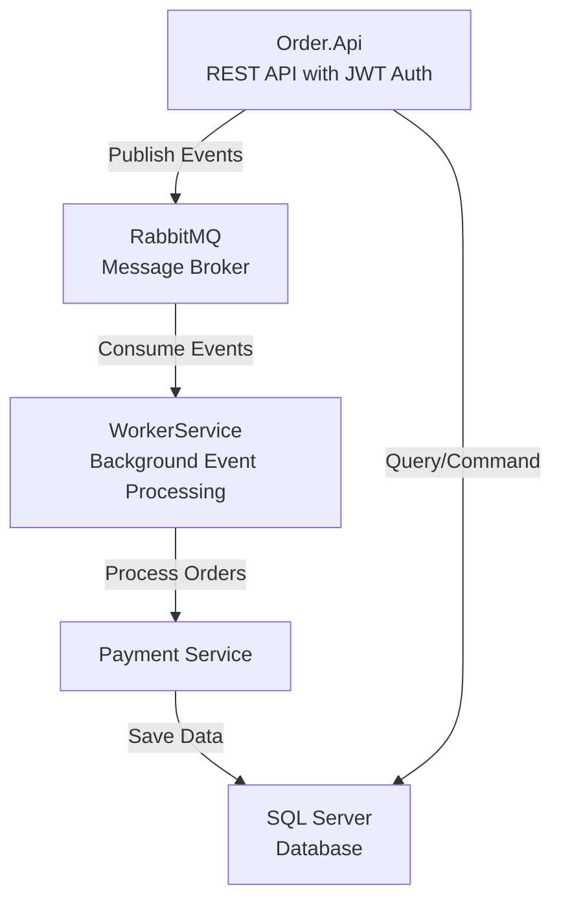
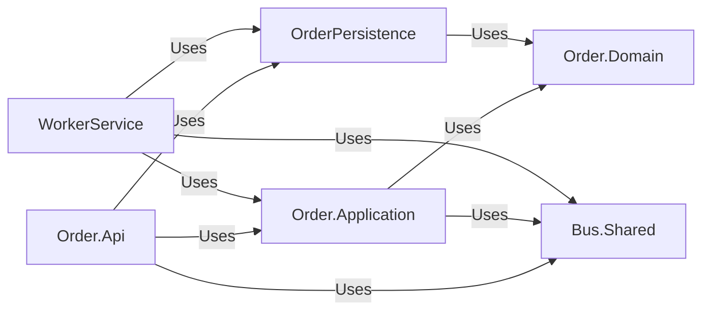
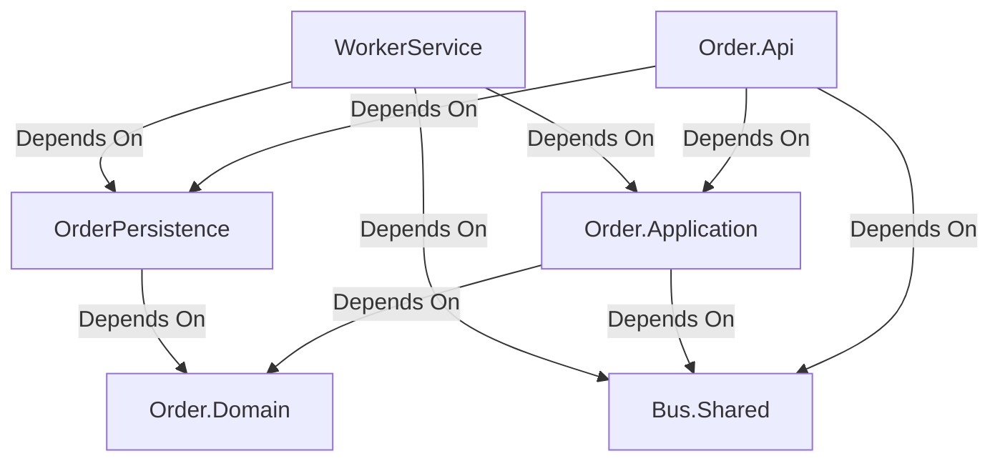

# ECommerce Microservices Solution

A modern, scalable e-commerce microservices architecture built with **.NET 9**, featuring order management, event-driven messaging, and a **Worker Service** for background processing.

## Table of Contents

- [Architecture Overview](#architecture-overview)
- [Project Structure](#project-structure)
- [Prerequisites](#prerequisites)
- [Getting Started](#getting-started)
- [Configuration](#configuration)
  - [Bus Selection (RabbitMQ / Kafka / Redis)](#bus-selection-rabbitmq--kafka--redis)
- [API Documentation](#api-documentation)
- [Features](#features)
- [Technologies](#technologies)
- [Development](#development)
- [Docker Deployment](#docker-deployment)
- [Troubleshooting](#troubleshooting)
- [Contributing](#contributing)

## Architecture Overview

This solution follows a **microservices architecture** with event-driven communication.

> Note: The active message broker is configurable (RabbitMQ/Kafka/Redis). The diagrams below show RabbitMQ as an example.



**Key Components:**
- **Order.Api**: REST API with authentication, validation, and rate limiting
- **RabbitMQ**: Event-driven messaging for decoupled communication
- **WorkerService**: Background worker processing order events
- **Payment Service**: Handles payment processing logic
- **SQL Server**: Persistent data storage

## Project Structure

The solution follows Clean Architecture principles with the following structure:

### Directory Tree

```
ECommerce/
|
+-- Order.Api/
|   +-- Endpoints/  # Route definitions and handlers
|   |   +-- Orders/
|   |   |   +-- SendOrderEndpoint.cs
|   |   |   +-- CancelOrderEndpoint.cs
|   |   +-- OrderEndpoints.cs
|   |
|   +-- Extensions/      # Dependency Injection & Middleware
|   |   +-- ServiceCollectionExtensions.cs
|   |   +-- ApplicationBuilderExtensions.cs
|   |   +-- AuthenticationExtensions.cs
|   |   +-- AuthorizationExtensions.cs
|   |   +-- DbContextExtensions.cs
|   |   +-- ApiVersioningExtensions.cs
|   |   +-- HealthCheckExtensions.cs
|   |   +-- FluentValidationExtensions.cs
|   |   +-- RateLimitingExtensions.cs
|   |
|   +-- Middleware/ # Custom middleware
|   |   +-- RateLimitingMiddleware.cs
|   |
|   +-- Services/        # Business logic
|   |   +-- TokenService.cs
|   |
|   +-- Options/     # Configuration models
|   |   +-- JwtOptions.cs
|   |   +-- RateLimitOptions.cs
|   |
|   +-- Program.cs# Application entry point
|   +-- appsettings.json
|   +-- appsettings.Development.json
|+-- Order.Api.http
|   +-- OrderApi.csproj
|   +-- Dockerfile
|
+-- Order.Application/       # Application Layer
|   +-- Orders/
| |   +-- Commands/
|   |   |   +-- CreateOrder/
|   |   |   |   +-- CreateOrderCommand.cs
|   |   |   |   +-- CreateOrderCommandHandler.cs
|   |   |   |   +-- Validators/
|   |   |   |    +-- CreateOrderCommandValidator.cs
|   |   |   |       +-- AddressDtoValidator.cs
|   |   |   | +-- OrderItemDtoValidator.cs
|   ||   |       +-- PaymentDtoValidator.cs
|   |   |   |
|   |   |   +-- CancelOrder/
|   |   |       +-- CancelOrderCommand.cs
| |   |       +-- CancelOrderCommandHandler.cs
|   |   |       +-- Validators/
|   |   |+-- CancelOrderCommandValidator.cs
|   |   |
|   |   +-- Queries/
|   |   |   +-- GetOrder/
|   | |       +-- GetByIdOrderCommand.cs
|   |   |     +-- GetByIdOrderCommandHandler.cs
|   | |       +-- Validators/
|   |   |           +-- GetByIdOrderCommandValidator.cs
|   |   |
|   |   +-- DTOs/
|   |       +-- OrderDto.cs
|   |       +-- OrderItemDto.cs
|   |       +-- OrderStatus.cs
|   |       +-- CreatedOrderDto.cs
|   |       +-- ProductOrderDto.cs
|   |       +-- AdressDto.cs
|   |
|   +-- Services/
|   |   +-- IPaymentService.cs
|   |   +-- PaymentService.cs
|   |
|   +-- ServiceResult.cs
|   +-- OrderApplication.csproj
|
+-- Order.Domain/ # Domain Layer
|   +-- Orders/
|   |   +-- Order.cs
|   |   +-- OrderItem.cs
|   |   +-- Address.cs
|   |   +-- OrderStatus.cs
|   |
|   +-- Repositories/
|   |   +-- IOrderRepository.cs
|   |   +-- IUnitOfWork.cs
| |
|   +-- Entity.cs
|   +-- IAggregateRoot.cs
|   +-- ValueObject.cs
|   +-- Idempotency.cs
|   +-- EventType.cs
|   +-- OrderDomain.csproj
|
+-- OrderPersistence/    # Data Access Layer
|   +-- Repositories/
|   |   +-- OrderRepository.cs
|   |   +-- UnitOfWork.cs
|   |
|   +-- Configurations/
|   |   +-- OrderConfiguration.cs
|   |   +-- OrderItemConfiguration.cs
|   |
|   +-- Migrations/
|   |   +-- [Migration files]
|   |
|   +-- ApplicationDbContext.cs
|   +-- AssemblyReference.cs
|   +-- OrderPersistence.csproj
|
+-- Bus.Shared/      # Shared Infrastructure
|   +-- Events/
|   |   +-- BaseEvent.cs
|   |   +-- OrderCreatedEvent.cs
|   |
|   +-- Options/
|   |   +-- ServiceBusOption.cs
|   |
|   +-- RabbitMqBusService.cs
|   +-- IBusService.cs
|   +-- Bus.Shared.csproj
|
+-- WorkerService/     # Background Processing
|   +-- Consumers/
|   |   +-- OrderCreatedEventConsumer.cs
|   |
|   +-- Program.cs
|   +-- appsettings.json
|   +-- WorkerService.csproj
|   +-- Dockerfile
|
+-- docker-compose.yml
+-- README.md
+-- .gitignore
```

### Key Directories Explained

| Directory | Purpose |
|-----------|---------|
| `Order.Api/Endpoints` | REST API route definitions organized by domain |
| `Order.Api/Extensions` | Service registration and middleware configuration |
| `Order.Application/Orders` | Commands, Queries, DTOs, and Validators following CQRS pattern |
| `Order.Domain` | Core business entities and repository interfaces |
| `OrderPersistence` | EF Core implementation, migrations, and configurations |
| `Bus.Shared` | Event definitions and message broker service |
| `WorkerService/Consumers` | Background event consumers for async processing |

### Layer Dependencies



## Prerequisites

- **.NET 9 SDK** or later
- **SQL Server 2019** or later
- **RabbitMQ 3.x** or later
- **Docker** (optional, for containerized deployment)
- **Visual Studio 2022** or **VS Code**

### Required Services

```bash
# SQL Server
docker run -e "ACCEPT_EULA=Y" -e "SA_PASSWORD=YourPassword123!" -p 1433:1433 mcr.microsoft.com/mssql/server:2019-latest

# RabbitMQ
docker run -d --name rabbitmq -p 5672:5672 -p 15672:15672 rabbitmq:3-management
```

## Getting Started

### 1. Clone the Repository

```bash
git clone https://github.com/gizemorak/ECommerce.git
cd ECommerce
```

### 2. Configure appsettings

Update `Order.Api/appsettings.json`:

```json
{
  "ConnectionStrings": {
  "Database": "Server=localhost;Database=ECommerceDb;User Id=sa;Password=YourPassword123!;TrustServerCertificate=true;"
  },
  "JwtOptions": {
    "Issuer": "ecommerce-api",
    "Audience": "ecommerce-client",
    "SecretKey": "your-super-secret-key-that-is-at-least-32-characters-long-change-in-production",
    "ExpirationInMinutes": 60
  },
  "ServiceBusOption": {
    "HostName": "localhost",
    "Port": 5672,
    "UserName": "guest",
    "Password": "guest"
  },
  "RateLimitOptions": {
    "PermitLimit": 100,
    "WindowInSeconds": 60,
"QueueLimit": 2
  }
}
```

### 3. Create Database

```bash
cd Order.Api
dotnet ef database update --project ../OrderPersistence/OrderPersistence.csproj
```

### 4. Run the Solution

```bash
# Terminal 1: Order.Api
cd Order.Api
dotnet run

# Terminal 2: WorkerService
cd WorkerService
dotnet run
```

API will be available at: `https://localhost:5001`
Swagger UI: `https://localhost:5001/swagger/index.html`

## Configuration

### JWT Authentication

**Generate JWT Token:**
```csharp
// Use the TokenService in your auth endpoint
var tokenService = serviceProvider.GetRequiredService<ITokenService>();
var token = tokenService.GenerateToken(
  userId: "user-123",
  email: "user@example.com",
  roles: new[] { "User" }
);
```

**Use Token in Requests:**
```bash
curl -H "Authorization: Bearer <token>" \
  POST https://localhost:5001/api/v1/orders/send
```

### Rate Limiting

Global rate limiting is applied automatically:
- **Authenticated Users**: Limited by UserID
- **Anonymous Users**: Limited by IP Address
- **Default**: 100 requests per 60 seconds

Configure in `appsettings.json`:
```json
"RateLimitOptions": {
  "PermitLimit": 100,
  "WindowInSeconds": 60,
  "QueueLimit": 2
}
```

### Health Checks

```bash
# Liveness check
curl https://localhost:5001/health

# Readiness check (includes database)
curl https://localhost:5001/health/ready
```

## API Documentation

### Base URL
```
https://localhost:5001/api/v1
```

### Authentication
All endpoints require a valid JWT token in the Authorization header:
```
Authorization: Bearer <token>
```

### Endpoints

#### 1. Send Order
```http
POST /orders/send
Content-Type: application/json
Authorization: Bearer <token>

{
  "userId": "550e8400-e29b-41d4-a716-446655440000",
  "adressdto": {
    "street": "123 Main St",
    "city": "New York",
    "state": "NY",
    "country": "USA",
    "zipCode": "10001"
  },
  "orderItems": [
    {
      "productId": "prod-123",
      "productName": "Laptop",
  "price": 999.99
    }
  ],
  "payment": {
    "cardNumber": "4532015112830366",
    "cardHolderName": "John Doe",
    "expiration": "12/25",
    "cvc": "123",
    "amount": 999.99
  }
}
```

**Response:**
```json
{
  "status": "204 No Content"
}
```

#### 2. Cancel Order
```http
POST /orders/cancel
Content-Type: application/json
Authorization: Bearer <token>

{
  "orderId": 1
}
```

**Response:**
```json
{
  "status": "204 No Content"
}
```

#### 3. Get Order
```http
GET /orders/{orderId}
Authorization: Bearer <token>
```

**Response:**
```json
{
  "data": {
    "orderId": 1,
    "orderStatus": "Completed",
    "totalPrice": 999.99,
    "buyerId": "550e8400-e29b-41d4-a716-446655440000"
  },
  "status": "200 OK"
}
```

### Response Codes

| Code | Description |
|------|-------------|
| 200  | OK |
| 204  | No Content |
| 400  | Bad Request (Validation Error) |
| 401  | Unauthorized (Missing/Invalid Token) |
| 404  | Not Found |
| 429  | Too Many Requests (Rate Limited) |
| 500  | Internal Server Error |

## Features

### Order Management
- [x] Create orders with multiple items
- [x] Cancel orders
- [x] Retrieve order details
- [x] Order status tracking

### Authentication & Authorization
- [x] JWT-based authentication
- [x] Role-based authorization
- [x] Token generation service
- [x] Configurable token expiration

### Validation
- [x] FluentValidation integration
- [x] Request validation
- [x] Business rule validation
- [x] Custom error messages

### API Quality
- [x] API versioning
- [x] Health checks (liveness & readiness)
- [x] Comprehensive logging
- [x] Rate limiting (per-user & per-IP)
- [x] Swagger/OpenAPI documentation

### Event-Driven Architecture
- [x] RabbitMQ message broker
- [x] Event publishing
- [x] Background event processing
- [x] Idempotency handling
- [x] Dead-letter queue (DLQ)

### Database
- [x] Entity Framework Core
- [x] SQL Server
- [x] Automated migrations
- [x] Repository pattern

## Technologies

| Technology | Purpose | Version |
|-----------|---------|---------|
| .NET | Framework | 9.0 |
| ASP.NET Core | Web API | 9.0 |
| Entity Framework Core | ORM | 9.0.12 |
| SQL Server | Database | 2019+ |
| RabbitMQ | Message Broker | 3.x |
| MediatR | Command/Query Handler | 14.0.0 |
| FluentValidation | Input Validation | 11.9.2 |
| JWT Bearer | Authentication | 9.0.0 |
| Swagger/OpenAPI | API Documentation | 6.6.2 |

## Development

### Running Tests (Future)
```bash
dotnet test
```

### Code Standards
- [x] Nullable reference types enabled
- [x] Implicit usings enabled
- [x] C# 13.0
- [x] Clean Architecture principles

### Project Dependencies



## Docker Deployment

### Build Images

```bash
# Order.Api
docker build -f Order.Api/Dockerfile -t ecommerce-api:latest .

# WorkerService
docker build -f WorkerService/Dockerfile -t ecommerce-worker:latest .
```

### Run with Docker Compose

```bash
docker-compose up -d
```

This will start:
- Order.Api (port 5001)
- WorkerService (background)
- SQL Server (port 1433)
- RabbitMQ (port 5672)

## Environment Variables

Create a `.env` file in the root directory:

```env
# Database
DB_CONNECTION_STRING=Server=sqlserver;Database=ECommerceDb;User Id=sa;Password=YourPassword123!;TrustServerCertificate=true;

# RabbitMQ
RABBITMQ_HOST=rabbitmq
RABBITMQ_PORT=5672
RABBITMQ_USER=guest
RABBITMQ_PASSWORD=guest

# JWT
JWT_SECRET_KEY=your-super-secret-key-that-is-at-least-32-characters-long-change-in-production
JWT_ISSUER=ecommerce-api
JWT_AUDIENCE=ecommerce-client
JWT_EXPIRATION_MINUTES=60
```

## Security Considerations

1. **JWT Secret**: Change the default secret key in production
2. **Database Credentials**: Use environment variables
3. **HTTPS**: Always use HTTPS in production
4. **Rate Limiting**: Adjust limits based on your needs
5. **Input Validation**: All inputs are validated with FluentValidation
6. **CORS**: Configure CORS policy for your frontend domain

## Additional Resources

- [.NET 9 Documentation](https://learn.microsoft.com/en-us/dotnet/core/whats-new/dotnet-9)
- [Entity Framework Core](https://learn.microsoft.com/en-us/ef/core/)
- [RabbitMQ Documentation](https://www.rabbitmq.com/documentation.html)
- [JWT.io](https://jwt.io/)

## Troubleshooting

### Database Connection Issues
```bash
# Check SQL Server is running
docker ps | grep mssql

# Reset database
dotnet ef database drop --project OrderPersistence
dotnet ef database update --project OrderPersistence
```

### RabbitMQ Connection Issues
```bash
# Check RabbitMQ is running
docker ps | grep rabbitmq

# Access RabbitMQ management UI
http://localhost:15672 (guest/guest)
```

### Port Already in Use
```bash
# Find process using port
lsof -i :5001  # macOS/Linux
netstat -ano | findstr :5001  # Windows

# Kill process
kill -9 <PID>  # macOS/Linux
taskkill /PID <PID> /F  # Windows
```

## License

This project is licensed under the MIT License - see the LICENSE file for details.

## Contributing

Contributions are welcome! Please follow these steps:

1. Fork the repository
2. Create a feature branch (`git checkout -b feature/AmazingFeature`)
3. Commit your changes (`git commit -m 'Add AmazingFeature'`)
4. Push to the branch (`git push origin feature/AmazingFeature`)
5. Open a Pull Request

## Support

For support, email support@ecommerce.com or open an issue on GitHub.

---

**Last Updated**: 2024
**Version**: 1.0.0
**Status**: Active Development
